  

  

  Desarrollo productos web cuidando tanto la lógica como la experiencia visual.

  
  
  

---

## Sobre mí

Soy desarrollador frontend y estudiante de Ingeniería en Software.

Me enfoco en construir aplicaciones que sean fáciles de utilizar, visualmente consistentes y sostenibles a medida que crecen. Trabajo principalmente con **React, Next.js y TypeScript**, integrando autenticación, consumo de APIs, gestión de estado, validación de datos y control de permisos.

Mi experiencia en diseño gráfico también forma parte de cómo desarrollo: presto atención a la jerarquía visual, los espacios, la tipografía y los pequeños detalles que mejoran la experiencia del usuario.

Actualmente estoy fortaleciendo mis conocimientos de arquitectura frontend y backend, mientras construyo proyectos reales y avanzo hacia una oportunidad remota como desarrollador.

---

## Stack

### Frontend

  
  
  
  
  
  

### Backend y datos

  
  
  
  
  

### Herramientas

  
  
  
  

---

## Proyectos destacados

### Teslo Shop

Aplicación de comercio electrónico con autenticación, pagos y administración de productos.

* Autenticación con NextAuth.
* Roles de administrador y usuario.
* Integración de pagos con PayPal.
* Panel para gestionar productos y órdenes.

  
  

---

### Project Manager

Aplicación para organizar proyectos, tareas y permisos de usuarios.

* Autenticación mediante JWT.
* Gestión de proyectos y tareas.
* Permisos basados en usuarios.
* Operaciones CRUD y consumo de API.

  
  

---

### Quiosco de Pedidos

Sistema para gestionar pedidos, órdenes y el flujo de trabajo de una cocina.

* Registro y control de pedidos.
* Vista separada para el área de cocina.
* Actualización del estado de las órdenes.
* Interfaz optimizada para una operación rápida.

  
  

---

## En qué estoy trabajando

* Profundizando en React, Next.js y arquitectura frontend.
* Fortaleciendo mis conocimientos de backend y diseño de APIs.
* Construyendo aplicaciones con mayor enfoque en escalabilidad.
* Preparándome para trabajar como Frontend Developer remoto.

---

## Actividad en GitHub

  
  

---

## Hablemos

Estoy abierto a oportunidades remotas, colaboraciones y proyectos donde pueda aportar desde el desarrollo frontend y el diseño de interfaces.

  <a href="mailto:hello@jeancarlosortiz.com">
    <strong>hello@jeancarlosortiz.com</strong>
  </a>
   
  <a href="https://dev.jeancarlosortiz.com/">Portafolio</a>
  ·
  <a href="https://jeancarlosortiz.com">Web comercial</a>
  ·
  <a href="https://www.linkedin.com/in/jean-carlos-ortiz-636119187/">LinkedIn</a>

  

